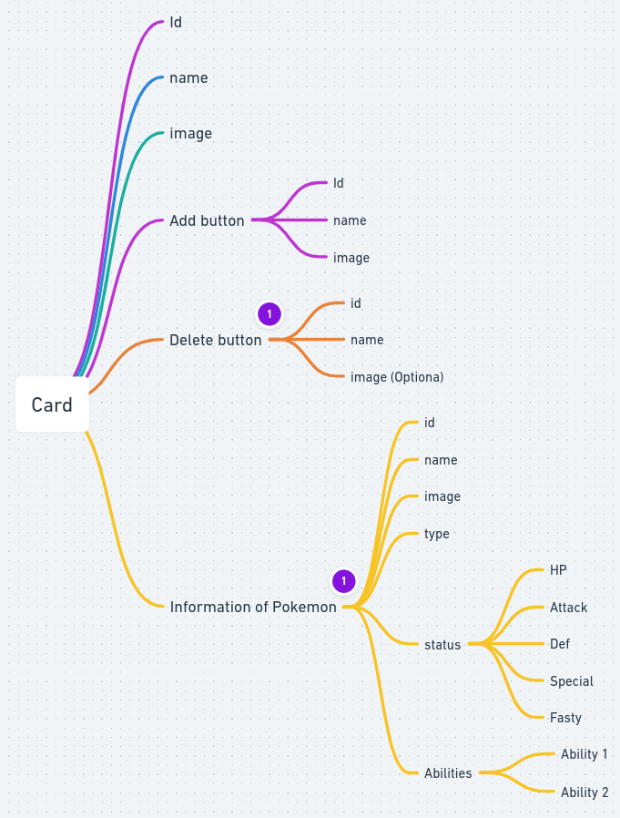
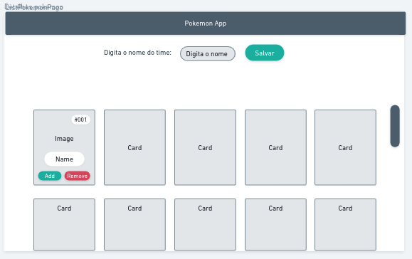

Olá pessoal tudo bem? espero que sim!
Esse projeto surgiu de um desafio da Simbiose para poder aprender VueJS 3, e realmente me ajudou a entender muito sobre o ciclo de vida de um sistema.

Básicamente ele é um CRUD que consome uma API do PokeAPI

## Ingredients

- [VueJS 3](https://vuejs.org/)
- [Vue Router](https://router.vuejs.org/)
- [Vuex](https://vuex.vuejs.org/)
- [Typescript](https://www.typescriptlang.org/)
- [Axios](https://axios-http.com/docs/intro)

## Esboço do projeto

Da uma olhada no esboço [aqui](https://whimsical.com/fluxo-de-app-Abc9Z7K4xG5YLAS2T54tsH)

- Uma das coisas que aprendi e levarei para meus proximos projetos é a planificação dos dados para cada componente (props e emits).
  

- Outra parte que recomendo dedicar tempo é entender a experiência de usuário para o sistema, como deixar a metade do card para o usuário ter a tendencia de descer e encontrar mais cards.
  

## Aqui você pode probar o app!

https://pokemon-app-vue3.vercel.app/
